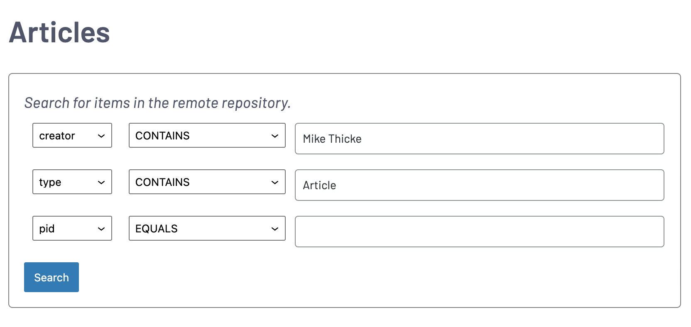

# Fedora Embed

Fedora Embed is a WordPress single-block plugin for embedding items stored in
[Fedora](https://duraspace.org/fedora/) repositories in WordPress posts and
pages.

It is written primarily for the [Humanities Commons
CORE](https://hcommons.org/core/) repository, though it is designed to work
with any Fedora repository through its [REST
API](https://wiki.lyrasis.org/display/FEDORA38/REST+API).

This software is in active development.

## What it Does

View a live demo here: [mikethicke.com/fedora-embed-demo](mikethicke.com/fedora-embed-demo)

One of the best ways for academics to increase the reach of their publications
is to upload preprints or open access publications of their work to public
repositories. Many of us also maintain personal or professional websites that
list our work. If you have a WordPress website, this plugin allows you to
automatically list work you have uploaded to the [Humanities Commons
CORE](https://hcommons.org/core/) repository so that your website is always
up-to-date and consistently formatted.

Here is how it looks to your visitors:

*Front-end view of the plugin*

## Usage

1. Set the base URL of the repository on the Settings|Fedora Embed page in the
   WordPress dashboard. For Humanities Commons CORE, the base URL is https://hcommons.org/deposits/ .
2. Add / edit a page or post with the WordPress block editor (the classic editor is not currently supported).
3. Using the block inserter ( type '/' or click the + icon), insert a Fedora
   Embed block. You should see something like this:

4. Fill out the search form and click 'Search'. If there are any results for
   your search, the search form will be replaced by the front-end view of the
   plugin, showing those results. You can click 'Edit Search' to return to the
   search form.
5. Add whatever other content you'd like to the page. You can also add multiple
   Fedora Embed blocks, for example to have one section for articles and
   another for book reviews.
6. Publish your post. That's it!

## Installation

1. Download the [latest release](https://github.com/mikethicke/fedora-embed/releases) from GitHub.
2. Install and activate the plugin through the WordPress dashboard ( Plugins | Add New -> Upload Plugin ).

## Notes and Limitations

1. While the plugin is ultimately intended to function on any Fedora-based repository, it has been developed for and exclusively tested on Humanities Commons. It is not currently expected to function with other repositories. If there is a repository you'd like to use this plugin with, please open an issue.
2. To query the remote repository, the plugin relies on the [SimpleXML](https://www.php.net/manual/en/book.simplexml.php) PHP package. This package is standard with PHP 5.6, but is not included in many PHP 7+ distributions. If you are unable to generate any search results, ensure that this package is installed (the plugin does not yet explicitly test for the package; it will just fail silently).
3. The plugin naively passes search parameters to the repository's REST API and displays the results. Fedora's API is very finicky about delivering search results. In particular, the 'EQUALS' comparator does not work *ever* with many fields. If your search fails, try the 'CONTAINS' parameter.
4. It is currently not possible to search CORE for your Humanities Commons username, so if you share a full name with another user, there is no way to disambiguate between your works and theirs. This is a limitation of the CORE repository. If you are having a problem with name collisions, I suggest naming the files you upload with a unique prefix and searching for that prefix in the 'label' field.
5. The plugin will display all search results from your query, so it is possible that another user could upload work that matches your query (either inadvertently or maliciously), and this work will be displayed on your website.

## Contributions and Feedback

If you wish to contribute to the project, you can contact me at [mikethicke@gmail.com](mailto:mikethicke@gmail.com), or [submit a pull request](https://github.com/mikethicke/fedora-embed/pulls) with your proposed changes.

If you find a bug or want to request a feature, you can [create a new issue](https://github.com/mikethicke/fedora-embed/issues).

## Requirements

 * PHP 5.6+
 * [SimpleXML](https://www.php.net/manual/en/book.simplexml.php) package (standard with PHP 5.6, often not included with PHP 7).

## Acknowledgments

Fedora Embed uses the vivid [SVG File Icons](https://fileicons.org/) generously provided by Daniel M. Hendricks.

