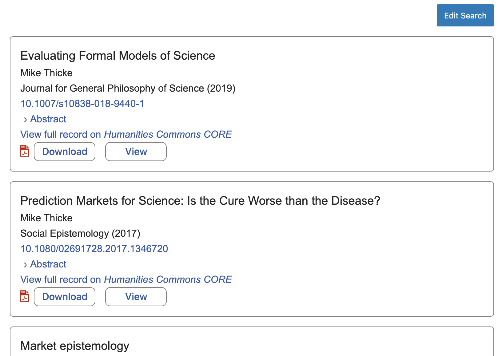

# Commons Connect User Guide

Commons Connect allows WordPress sites to embed content from [Humanities
Commons](https://hcommons.org/). It is developed by [MESH
Research](https://www.meshresearch.net/) at [MSU](https://msu.edu/).

[Humanities Commons](https://hcommons.org/) is a social network for people
working in the humanities. It is open to all, regardless of affiliation or
professional status. Humanities Commons also includes organization- and
society-specific sites such as [MSU Commons](https://commons.msu.edu/), [MLA
Commons](https://mla.hcommons.org/), [ASEEES
Commons](https://aseees.hcommons.org/), [UP Commons](https://up.hcommons.org/),
and [SAH Commons](https://sah.hcommons.org/). This plugin allows you to embed
content in your WordPress site from any of these Commonses.

## Support and Issues

Commons Connect is currently in active development. It is missing many planned
features, and those that exist may not function as expected. It is currently
intended for experimentation and feedback purposes. Feedback and support
requests can be directed to the plugin's [GitHub issues
page](https://github.com/MESH-Research/commons-connect/issues). To submit a bug
report or request for support, please first review the open issues to see
whether your problem has already been reported. If so, you can comment on the
existing issue. If not, you can open a new issue by clicking 'New Issue'. Please
describe your problem in as much detail as you can, and if possible include
screenshots. If we cannot reproduce your issue by following your description, it
will be hard for us to offer you assistance or address the problem.

## Overview

Commons Connect consists of four components:

- **Core Connect**: Embed content from Humanities Commons CORE
- **Profiles Connect**: Embed content from Humanties Commons profiles
- **Groups Connect**: Embed content from Humanities Commons groups
- **Sites Connect**: Embed content from Humanities Commons WordPress sites

Each component provides a customizable block that can be inserted in a WordPress
post or page through the block editor (the classic editor is not supported).

Currently only Core Connect is implemented.

## Installation

1. Download the [latest
   release](https://github.com/MESH-Research/commons-connect/releases/latest/commons-connect.zip)
   from GitHub.
2. Install and activate the plugin through the WordPress dashboard ( Plugins |
   Add New -> Upload Plugin ).

To update the plugin, follow the same procedure and click 'Replace current with
uploaded' when prompted.

## Usage

### Core Connect

In the block editor (editing a post or page), use the block inserter to insert a
Core Connect block.

This will display a search form.

The search form consists of three rows of conditions, and each condition
consists of a field, a comparator, and a value. The search will return results
that match *all* of the conditions.

Currently, the productively searchable fields in the Humanities Commons CORE
repository are:

| Field       | Description                                 | Notes                                                          |
| ----------- | ------------------------------------------- | -------------------------------------------------------------- |
| pid         | Unique identifier for the deposit.          | hc:#####, where #### is 1 + the ID shown in the deposit's URL. |
| label       | Filename of the deposit.                    | The exact filename. Eg. research-manuscript.docx               |
| title       | Title of the deposit.                       |                                                                |
| creator     | Full name of person who made the deposit.   |                                                                |
| description | (Part of) the deposit's description.        |                                                                |
| publisher   | The deposit's publisher.                    | Eg. Springer Nature.                                           |
| date        | The *year* of publication.                  |                                                                |
| format      | MIME type of the deposit.                   | Eg. application/pdf.                                           |
| identifier  | pid of the deposit and its associated item. | The item ID is the pid - 1.                                    |

The CORE repository's search API is quite finicky. In particular, it almost
always fails to return results for the EQUALS comparator, and so the CONTAINS
comparator should generally be used instead.

When you click 'Search', the search form will be replaced by the search results
as your readers will see them. If you wish to edit the search, click 'Edit
Search'.

When you save and publish your post, your readers will see the search results as
they were displayed in the block editor. These results are dynamic---they query
the repository each time the page is loaded. This means that if you upload
further deposits to CORE, and have a search for deposits created by you on your
site, those deposits will automatically appear on your site without having to
edit the page.

Note also that multiple Core Connect blocks can be insterted in the same page.
You could, for instance, have one Core Connect block that searches for articles
and one that searches for syllabi.

## Settings

Site-wide settings are accessed through the Settings | Commons Connect menu in
the WordPress admin interface.

### Repository base URL

The base URL of the repository, https://hcommons.org/deposits/ for Humanities
Commons. You generally won't have to change this setting.

